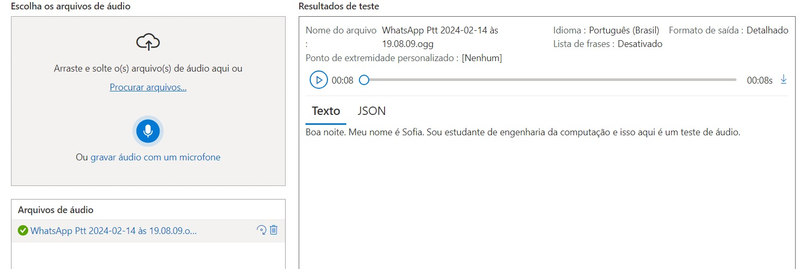
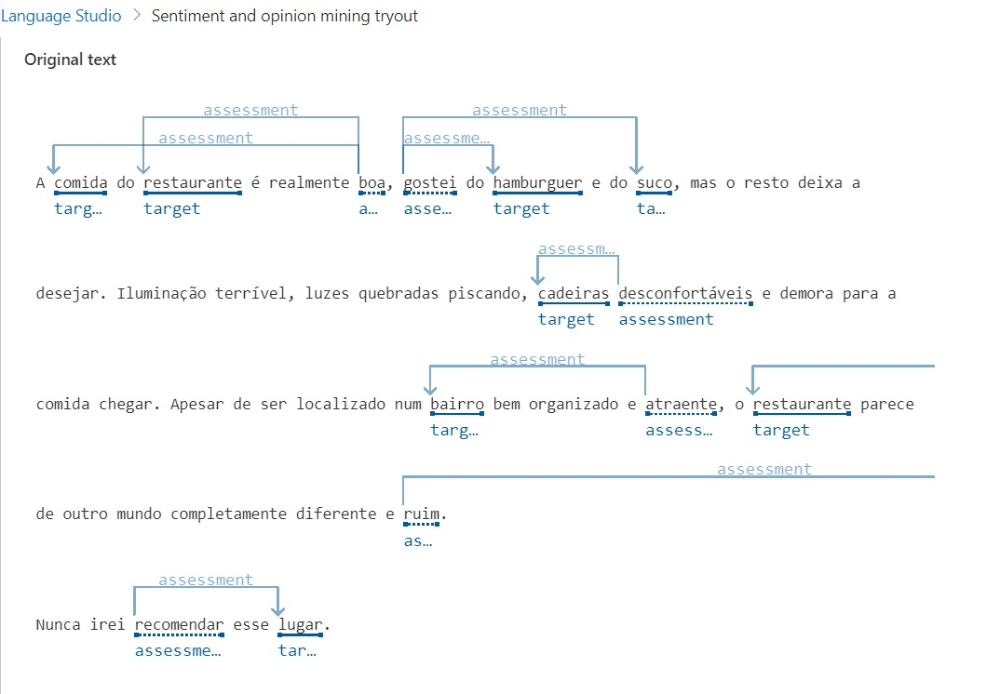
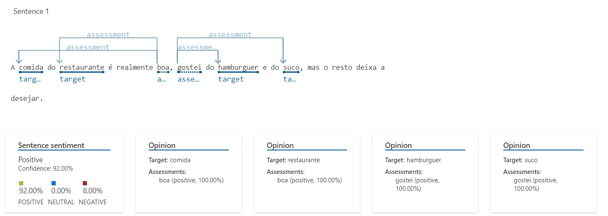
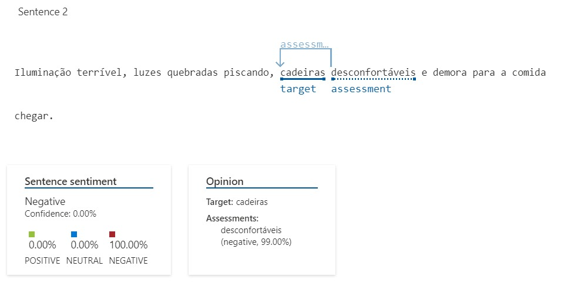
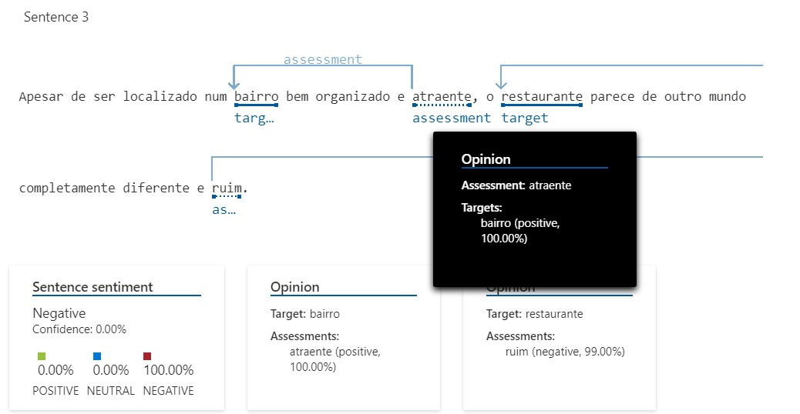
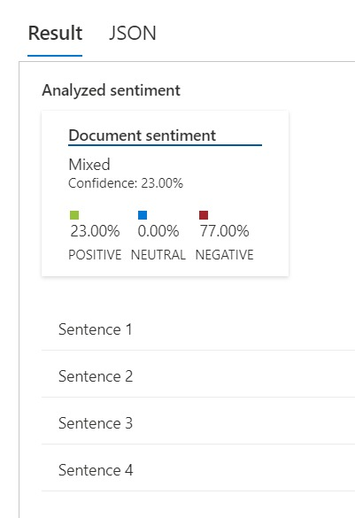

# projeto-linguagem-azure

Nas últimas aulas vimos sobre o Processamento de Linguagem Natural (NPL), suas aplicações e ferramentas. Esse tipo de utilização de IAs treinadas tem como base a **Análise de Texto**, podendo se ramificar para diversas áreas. Dentre elas: reconhecimento de entidade nomeada, extração de dados e informações, detecção de idiomas, tradução automática, resumos, IA conversacional, conversão de texto para fala e vice- versa, serviço de fala dentre outros. Visto isso, vou apresentar 2 exemplos de uso de IA treinadas em NPL de forma mais detalhada.

## Speech Studio Azure  :sound:

Cada ramificação de áreas de aplicação de uma NPL contém mais ramos especializados. Por exemplo, na área de fala, esse tipo de IA poderia ajudar legendando programas ou streamings ao vivo, documentar uma reunião presencial em tempo real. Imagine que está dirigindo e precisa enviar uma mensagem escrita mas não pode pela situação. Nesse caso uma IA poderia ajudar captando sua voz e escrevendo a mensagem por você. 

Quando se trata do caminho inverso, do texto para a fala surgem mais possibilidades. Pode ser utilizado para ajudar deficientes visuais a saber o que tem informado em seu celular a todo momento, leitura de um livro feita de uma IA para um usuário e mais qualquer aplicação que imaginar. 

Através do [Speech Studio](https://speech.microsoft.com/portal) da Microsoft Azure se obtém uma grande variedade de serviços, inclusive do meu exemplo anterior que se trata da conversão de fala em texto. Nesse exemplo, escolhi um áudio autoral meu para servir de teste.  Veja  ao lado direito que a máquina conseguiu realizá-la normalmente. Fiz uma [captura em vídeo](output/videoTesteAudio.mp4) mostrando a realização do teste para que possa ouvir e ver acontecer. 

## Language Studio Azure  :bulb:

Outra aplicação de uma IA treinada em NPL é quando se trata de interpretar o texto. No último exemplo falei de conversão, aqui falarei de interpretação. Nessa área o programa é capaz de interpretar sentenças, sentimentos a respeito do autor, palavras-chave e mais. Por exemplo, a IA pode ser usada para identificar usuários sendo agressivos com outros, podendo assim intervir, pode ser usada para analisar e retornar as principais avaliações de seu restaurante, mostrando pontos positivos e pontos que precisam de ajustes. Também pode ser utilizado como ferramenta de estudo para previsão de melhores oportunidades para um determinado negócio, como lançamento ou criação de produtos. Através disso pode-se automatizar processos que antes necessitavam de muito tempo para sua conclusão. 

No [Language Studio Azure](https://language.cognitive.azure.com/home), enviei o seguinte texto para ser analisado:

***
A comida do restaurante é realmente boa, gostei do hambúrguer e do suco, mas o resto deixa a desejar. Iluminação terrível, luzes quebradas piscando, cadeiras desconfortáveis e demora para a comida chegar. Apesar de ser localizado num bairro bem organizado e atraente, o restaurante parece de outro mundo completamente diferente e ruim. 
Nunca irei recomendar esse lugar.
***

Esse foi o retorno obtido:

Perceba que o programa fez a análise de todo o texto, postando sobre qual palavra está se referindo. E até mesmo nos casos que não são adjetivos ele reconhece, como na última linha. Esse programa separa cada sentença para avaliar individualmente e gostaria de falar sobre.

#### Sentença 1

Na primeira sentença perceba que ele identificou os elogios e referências porém, mesmo sem mostrar visualmente sua análise, perceba que foi reconhecido que nessa sentença não havia 100% de afirmações positivas. Ele conseguiu identificar que o trecho "mas o resto deixa a desejar" é uma afirmação negativa. Além disso, veja que o código também consegue listar sobre quais tópicos foram falados e sua porcentagem de positividade ou não. 

#### Sentença 2

Aqui temos um resultado completamente diferente. A IA afirma que houve apenas afirmações negativas, identificou que o alvo da crítica foi as cadeiras mas não conseguiu fazer o mesmo a respeito do tempo de chegada. Isso deve ter ocorrido devido a minha linguagem utilizada. Isso é um ótimo exemplo da necessidade do estudo sobre a linguagem coloquial, pois devido a uma determinada forma de se expressar, a IA não identificou corretamente. 

### Sentença 3

Foi falado exemplos em que se fala bem e mal ao mesmo tempo, um exemplo que fala apenas mal e temos aqui um outro exemplo completamente diferente. Nessa sentença foi identificado uma afirmação positiva (atraente 100% sobre o bairro) e uma negativa (ruim 99% sobre o restaurante), mesmo assim a avaliação final foi 100% ruim. 

A IA foi capaz de entender que o texto original completo se trata sobre o restaurante e não sobre o bairro. E mais, a afirmação positiva sobre o bairro foi citada apenas para intensificar a afirmação negativa sobre o restaurante. Esse exemplo é perfeito para analisar as capacidades de uma IA em relação a capacidade humana. 

### Conclusão do teste :white_check_mark:

O programa concluiu que esse texto tem alguns elogios sobre o restaurante, como quando fala sobre a comida, mas em sua grande maioria contém apenas críticas negativas. 

Quando se trata de IA, primeiro tem que definir o problema e que tipo de aplicação é a mais adequada para alcançar a solução. Seguindo esses dois principais focos é possível usar essa ferramenta de diversas formas ao nosso favor. 

